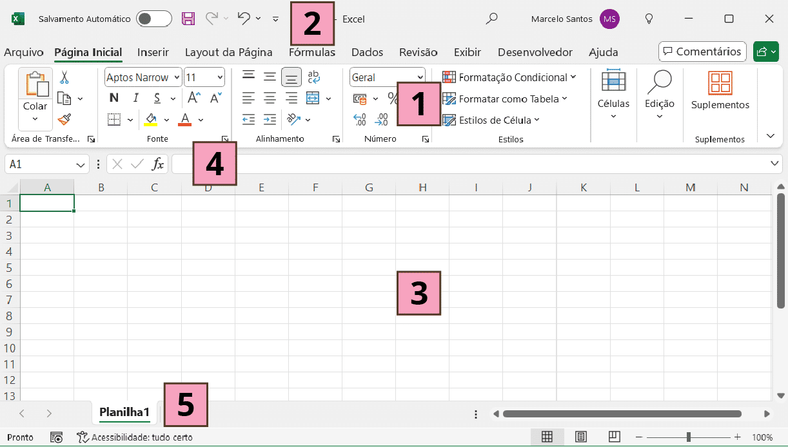

# Módulo 1

1.1 Visão Geral do Excel

A Faixa de Opções é dividida em várias guias (Arquivo, Página Inicial, Inserir, Layout da Página, Fórmulas, Dados, Revisão, Exibir etc.), cada uma contendo diferentes grupos de comandos.

Localizada no topo da janela do Excel, ela pode ser personalizada com comandos de uso frequente, como Salvar, Desfazer e Refazer.

A área principal do Excel é composta por células organizadas em linhas (numeradas) e colunas (letradas). Cada célula pode conter dados, como números, texto, fórmulas ou gráficos.

Mostra o conteúdo da célula ativa e é usada para inserir ou editar dados e fórmulas.

Um arquivo do Excel (Pasta de Trabalho) pode conter várias planilhas, que são abas na parte inferior da janela. Cada planilha é uma página separada dentro da pasta de trabalho.

1.2 Modelos de Pasta de Trabalho

- Formato do arquivo xlsx 
    Corresponde a uma pasta de trabalho excel, nela podemos ter várias planilhas
- Multiplas planilhas
- 