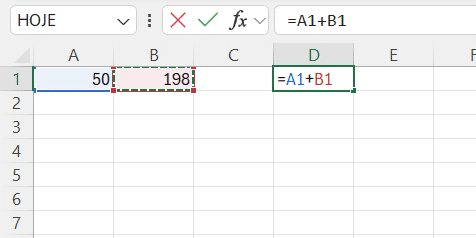

# Módulo 2

1. Introdução ao uso de fórmulas em Excel

Elementos de uma Fórmula

Referências de Células: indicam a localização dos dados em uma planilha. Ex.: A1, B2.

Operadores Matemáticos: símbolos que indicam a operação a ser realizada. Ex.: + (adição), - (subtração), * (multiplicação), / (divisão).

Funções: predefinições que realizam cálculos específicos usando valores especificados. Ex.: SOMA(), MÉDIA(), SE().

Usar Referências Absolutas e Relativas
As referências de células podem ser relativas (A1) ou absolutas ($A$1). As relativas mudam quando copiadas para outras células, enquanto as referências absolutas permanecem fixas.

Verificar Erros
Utilize o recurso de auditoria de fórmulas para identificar e corrigir erros nas suas fórmulas.

Aninhar Funções
Combine várias funções em uma única fórmula para realizar cálculos mais complexo

1.2 Auditoria de Fórmulas

